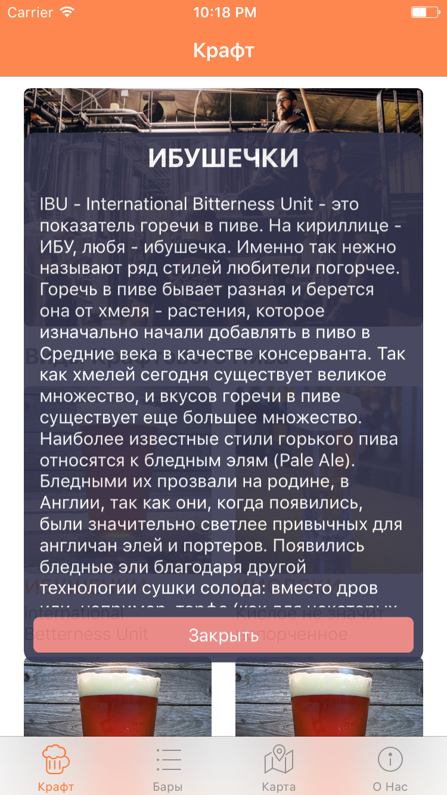

# InfoDescriptionPopoverViewController

## Current Syntax : Swift 3

This is Popover Controller used to show detailed description and title of pressed content of parent view controller. As opposite to apple Popover Controller, this controller presented at the center of the screen and don't has triangle view

**This Popover View Controller works in conjuction with MyPopoverPresentationController (See my other repository about detailed explanation)**

This Popover View Controller has subtype : `struct InfoDetailed` with two constants: `infoTitle : String` - used for title label & `infoDescription : String` - used for UITextView, so supports text formatting.
Also it has `data` property of type `InfoDetailed` which must be setted up in `perform` method of parent view controller.
It has Close button, to close the controller

###Most ease setup of this controller is in Storyboard:
  1. You must add new UIViewController to Storyboard.
  2. Add : UILabel, UIButton and UITextView.
  3. Connect outlets and action (already wrote in controller class, so just connect to your view from swift file)
  3. Setup Constraints as you like. But logical and default setup is as follows:
    * titleLabel - Up and centered
    * closeButton - Bottom and centered
    * descriptionTextView - all other space between `titleLabel` and `closeButton`
    (See the picture of my setup)
    
    

###Storyboard Segue setup:
  * `Kind:` Present Modally
  * Don't forget to add segue identifier

### ParentViewController setup:

declare constant for custom animation controller:
`let myPopoverPresentationController = MyPopoverPresentationController()`

In `prepare(for segue: UIStoryboardSegue, sender: Any?)` method you should write the following:
  ```
  // Check your segue identifier first
 let destinationVC = segue.destination as! InfoDetailPopoverViewController
 destinationVC.modalPresentationStyle = .custom
 destinationVC.transitioningDelegate = self
 destinationVC.data = InfoDetailPopoverViewController.InfoDetailed(infoTitle: "YOUR TITLE", infoDescription: "DESCRIPTION")
  ```
  **And for custom transition:**
  ```
  extension ParentVC : UIViewControllerTransitioningDelegate {
    
    func animationController(forPresented presented: UIViewController, presenting: UIViewController, source: UIViewController) -> UIViewControllerAnimatedTransitioning? {
        myPopoverPresentationController.direction = .Straight
        return myPopoverPresentationController
    }
    
    func animationController(forDismissed dismissed: UIViewController) -> UIViewControllerAnimatedTransitioning? {
        myPopoverPresentationController.direction = .Reversed
        return myPopoverPresentationController
    }
}
```

*Presented frame and position of `InfoDescriptionPopoverViewController` controlled by `myPopoverPresentationController` (see the code)*

*You can customize appearance and animations by check the code, it's really simple*

*If you need to add more you can subclass or edit files, but usually title and description is enouth by most popovers.*
Enjoy!
